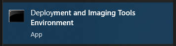
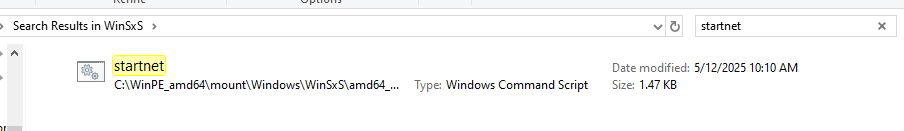
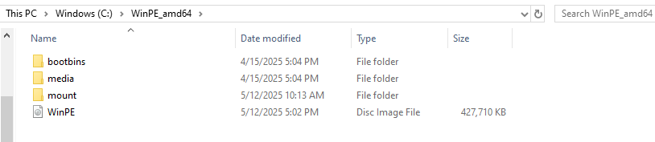
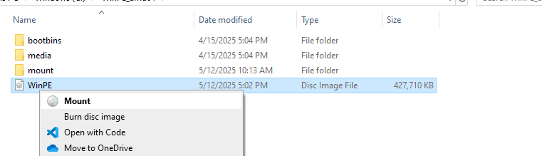
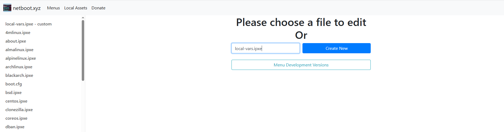
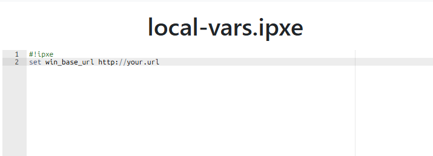
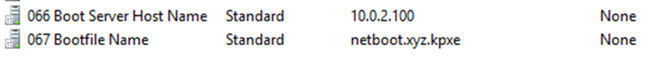

# WindowsDeployment
Here is a guide on how to create a custom windows image and deploy it using WinPE and netbootxyz


## Requirements

### For image capture 
 - 2 computers or 1 computer with 1 Virtual Machine
 - 1 USB key 32 Gb and higher

### For netbootxyz
 - DHCP + DNS servers
 - Docker


## Step1: Windows installation
First of all you'll need to install Windows (10 or 11) on your computer. For this you can use Windows MediaCreationTool or rufus if you already have an iso to create a bootable usb key.
https://support.microsoft.com/en-us/windows/create-installation-media-for-windows-99a58364-8c02-206f-aa6f-40c3b507420d#id0ejd=windows_10

After you have created the bootable usb key, you'll need to boot with it. When booting, press F2, F10 or the key that will allow you to enter the On Time Boot menu. Then boot ith the usb key and preceed with the installation.

If you don't want to use a Microsoft account during installation, disconnect from any network if connected, press Shift+F10 and run :

```
oobe\bypassnro
```

This is the command for Windows 10, this might not work on Windows 11.

## Step2: Prepare the Windows image

Now that Windows is installed on your computer, install all windows updates and the drivers or apps needed if you will deploy Windows on the same computers. For exemple, I will deploy Windows 10 on Dell laptops, so I will install Dell Command Update.

Once this is done, you can launch a sysprep to delete from the image all informations that are related to the local user you are using right now, with the graphical interface or the following command :

```
cd "C:\Windows\System32\Sysprep"
sysprep /oobe /generalize /shutdown
```

Sometimes, there are errors while running sysprep. 
I encountered a similar error :
 - Package Microsoft.LanguageExperiencePackit-IT_19041.3.7.0_neutral__8wekyb3d8bbwe was installed for a user, but not provisioned for all users. This package will not function properly in the sysprep image.

and fixed it with this command on powershell:
```
Remove-AppxPackage -allusers Package.name.version
```
You'll need to change the name of the package with the one causing the error. You can find it on sysprep logs.

https://azvise.com/2020/09/08/windows-10-sysprep-fails-due-to-an-app-that-was-installed-for-a-user-but-not-provisioned-for-all-users/

Once the sysprep is finished, do not turn on your computer, you need to prepare the WinPE usb key before. 


## Step 3: Prepare the WinPE USB key

WinPE is like a mini Windows and allows us to run scripts and capture images. Unlike sysprep, WinPE is not included in Windows so you'll have to install it on another machine that the one you used in the previous steps. 

https://learn.microsoft.com/en-us/windows-hardware/manufacture/desktop/download-winpe--windows-pe?view=windows-11

Once installed, you should be able to run "deployment and imaging tool environment" on your machine:


Run this app as administrator and run the following commands 

```
copype amd64 "C:\WinPE_amd64"      (only the first time you use WinPE)
Dism /Mount-Image /ImageFile:"C:\WinPE_amd64\media\sources\boot.wim" /index:1 /MountDir:"C:\WinPE_amd64\mount"
```

### 3.1 (optionnal): Create a script 
With WinPE, you can create a script that will run immediatly when booting. to create this script, you should modify the "startnet.cmd" file:
to find it, go there and search for it in the search bar:
```
C:\WinPE_amd64\mount\Windows\WinSxS\
```



There is another startnet.cmd file in the System32 folder but it will copy the content of the WinSxs's file so you don't need to modify it.

### 3.2 (optionnal): Add drivers to WinPE
You can also add drivers to WinPE. In my script I needed to be connected to the network so to ensure the connexion is done, I will add an ethernet driver to my WinPE.

To do so, you need the .inf file from the driver. Then, run the following command :
```
Dism /Add-Driver /Image:"C:\WinPE_amd64\mount" /Driver:"C:\driverLocation\driver.inf"
```

To add more customization to your WinPE such as adding langages or apps, follow this link, as I know, the default keyboard in WinPE is qwerty so you should add the azerty package if you have an azerty keyboard:

https://learn.microsoft.com/en-us/windows-hardware/manufacture/desktop/winpe-mount-and-customize?view=windows-11


Then commit the changes and unmount the WinPE image, and create an USB bootable key containing your custom WinPE:

```
Dism /Unmount-Image /MountDir:"C:\WinPE_amd64\mount" /commit
MakeWinPEMedia /UFD C:\WinPE_amd64 F:                    (replace F with your usb letter)
```

use `/discard` option instead of `/commit` if you don't want to save the changes you made

## Step 4: Capture the image

Take the 1rst computer again and boot with the WinPE key, the script should run. Cancel it with ```[CTRL+C]``` if you don't want it to complete. 
If you miss booting using the USB key and boot with the disk/Windows, you should rerun the sysprep. 

Use thoses commands to see which letters are assigned to which disks on the terminal:
```
diskpart
list vol
exit
```

then you can run this command, D is the disk where the image will be downloaded and C the disk you want to capture:

```
dism /Capture-Image /ImageFile:D:\install.wim /CaptureDir:C:\ /Name:"Windows10-Pro"
```


## Step 5: Configuring netbootxyz

Netbootxyz uses iPXE, which allows us to boot via network. You can use netbootxyz to deploy your custom WinPE and Windows 10 image.

I used docker-compose and the following `docker-compose.yml` configuration to run my netbootxyz server :

```
---
services:
  netbootxyz:
    image: ghcr.io/linuxserver/netbootxyz:latest
    container_name: netbootxyz
    environment:
      - PUID=1000
      - PGID=1000
      - TZ=Etc/UTC
#      - MENU_VERSION=1.9.9 #optional
      - PORT_RANGE=30000:30010 #optional
      - SUBFOLDER=/ #optional
      - NGINX_PORT=80 #optional
      - WEB_APP_PORT=3000 #optional
    volumes:
      - ./config:/config
      - ./assets:/assets #optional
    ports:
      - 3000:3000
      - 69:69/udp
      - 8080:80 #optional
    network_mode: "host"
    restart: unless-stopped
```
(network_mode is not necessary)

In the same folder where is located your docker-compose file, create 2 folders, `config` and `assets`.

Leave `config` empty.

Run `docker-compose up` to start the server, you should be able to see the web UI in `http://localhost:3000`


### Step 5.1 (optionnal): adding WinPE to netbootxyz

Open again the Deployment and Imaging tool environment and run this in order to create an iso file from your WinPE version:

```
MakeWinPEMedia /iso C:\WinPE_amd64 C:\WinPE_amd64\WinPE.iso
```



Mount the image.



Now go back to the assets folder and create this WinPE folder in it :

```

├── assets
│   └── WinPE
│       └── x64
├── config
└── docker-compose.yml
```

Then copy all the files from the mounted WinPE image and paste it in the x64 folder.

Then, on the web admin panel, create a file named `local-vars.ipxe`.



Then, add this line and replace the url by the url where the netbootxyz container is running .



This sould be good for the netbootxyz part. You can also customize the boot scripts, here is the official documentation:
https://netboot.xyz/docs 


## Step 6: DHCP configuration

There is many way to configure your dhcp server, I used `Windows server`. You can check in the documentation if you use dnsmasq. On Windows server, you simply have to set 2 rules, 66 and 67 like so:



(You need to change the ip adress)

Use `netboot.xyz.kpxe` if you will boot using ipv4 and `netboot.xyz.efi` for http boot.


Everything is now set up.

If you wish, you can also run the container using kubernetes for the netbootxyz server.

## Step 7 (optional): Add authentication to access admin panel 
You can add an authentication page to protect netbootxyz web ui. For this, you need to modify your `docker-compose.yml`, this one worked for me:

```
services:
  netbootxyz:
    image: ghcr.io/netbootxyz/netbootxyz
    container_name: netbootxyz
    environment:
      - PUID=1000
      - PGID=1000
      - TZ=Etc/UTC
      #- MENU_VERSION=1.9.9
      - SUBFOLDER=/
      - NGINX_PORT=80
      - WEB_APP_PORT=3000
    volumes:
      - ./config:/config
      - ./assets:/assets
    ports:
      #- "3000:3000"     # Web UI
      - "69:69/udp"     # TFTP pour PXE
      - "8080:80"    
    networks:
      - netboot

  nginx:
    image: nginx:alpine
    container_name: nginx_proxy
    ports:
      - "3000:80"  
    volumes:
      - ./nginx/nginx.conf:/etc/nginx/nginx.conf:ro
      - ./nginx/.htpasswd:/etc/nginx/.htpasswd
    depends_on:
      - netbootxyz
    networks:
      - netboot

networks:
  netboot:
    driver: bridge
```

Then, crete another folder named `nginx`. Inside it, add this `nginx.conf` file :

```
events {}

http {
    server {
        listen 80;
        server_name _;

        location / {
            auth_basic "Restricted Access";
            auth_basic_user_file /etc/nginx/.htpasswd;

            proxy_pass http://netbootxyz:3000;
            proxy_set_header Host $host;
            proxy_set_header X-Real-IP $remote_addr;
            proxy_set_header X-Forwarded-For $proxy_add_x_forwarded_for;
            proxy_set_header X-Forwarded-Proto $scheme;
        }
    }
}
```

You also need to create a file named `.htpasswd`. For username=user and password=user, the file looks like this:

```
user:{SHA}Et6pb+wgWTVmq3VpLJlJWWgzrck=
```

You can generate your own `.htpasswd` here: https://hostingcanada.org/htpasswd-generator/


